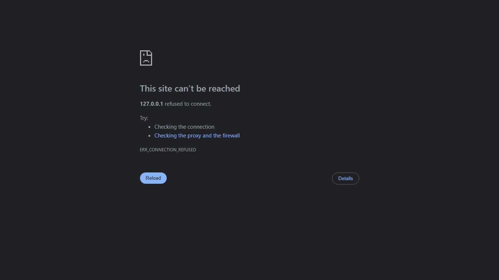

# AI Teaching Robot

Zoro is a classroom teaching robot system with a laptop-based AI backend and a Raspberry Pi Zero 2 W edge node. The laptop handles AI, voice, RAG, attendance, perception, and the dashboard. The Pi connects the physical robot hardware: USB camera, microphone, speaker, display face, and motor driver.



## Features

- Live classroom camera dashboard
- Streaming voice agent with STT, AI response generation, and TTS playback
- Syllabus upload and RAG-based teaching mode
- 3-second attendance scan and periodic attendance support
- Student transcript storage
- Classroom behavior and rule monitoring
- Camera-based obstacle awareness
- Manual WASD motor control and voice movement commands
- Raspberry Pi edge services for camera, mic, speaker, display face, and motors

## Architecture

```text
Browser Dashboard
        |
        v
Laptop FastAPI Backend
  - AI / RAG / voice pipeline
  - attendance and perception
  - dashboard API
        |
        v
Raspberry Pi Zero 2 W Edge Agent
  - USB camera
  - USB microphone
  - USB speaker
  - HDMI/touch display face
  - L298N motor driver
```

## Repository Layout

```text
laptop_backend/       Laptop AI backend and dashboard API
pi_agent/             Raspberry Pi edge agent for hardware IO
zoro_frontend/        React dashboard frontend
pi_face_sync/         Lightweight robot face display page
deploy/               Raspberry Pi systemd service templates
scripts/              Helper startup scripts
docs/                 Project docs and screenshots
```

## Environment

Copy `.env.example` to `.env` and fill in your own API keys locally.

```powershell
copy .env.example .env
```

Never commit `.env`, API keys, student photos, face data, attendance logs, transcripts, or uploaded syllabus files.

## Laptop Setup

```powershell
python -m venv .venv
.\.venv\Scripts\Activate.ps1
pip install -r requirements-laptop.txt
```

Run the backend:

```powershell
python -m uvicorn laptop_backend.main:app --host 0.0.0.0 --port 8001
```

Run the frontend:

```powershell
cd zoro_frontend
npm install
npm run dev -- --host 0.0.0.0 --port 5173
```

Dashboard:

```text
http://127.0.0.1:5173
```

## Raspberry Pi Setup

Install Pi dependencies:

```bash
python3 -m venv .venv
source .venv/bin/activate
pip install -r requirements-pi.txt
```

Run the Pi edge agent:

```bash
python3 -m uvicorn pi_agent.main:app --host 0.0.0.0 --port 8000
python3 -m pi_agent.body_node
```

For boot startup, use the systemd templates in `deploy/`.

## Safety

Test motors with the wheels off the ground first. Keep all API keys and student data outside git. This repository is source code only; runtime data belongs in local `data/` folders that are ignored by git.
